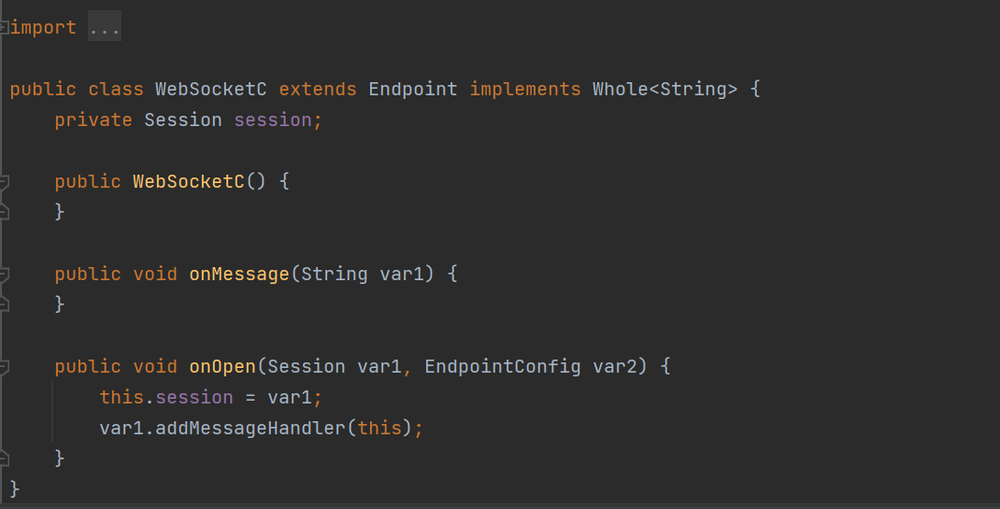

记录对于恶意代码查杀

小记：第一套程序

用java，采用rasp同样的方式，hook住jvm后查杀内存马，之后可能还会对无文件的agent进行操作

测试用文件放在asset文件夹

# 内存马检测查杀思路

万变不离其宗：找内存马就是找可以利用的Request 和Response

由于内存马它环境不同导致其多变的原因，应该把查杀改为修改内存马原有逻辑更恰当


**内存马类型检测是检测不完的，最好的就是行为检测**

其实一开始有把所有class在本地无文件的类给删除的想法，但是实际上有很多的内部类等等正常运行的类会获取不到其classloader或者得到了却拿不到其urlpath的问题，有两种方法

1.要么是改良其中对于无文件检测，将其进行排除干扰选项，然后遍历查找所有恶意的无文件的类进行删除，这里有许多不稳定的因素，对于干扰项可能是排除不完的，对于内存马写入我们定义的干扰选项中也是束手无策。

2.对于特定类型进行特征检测，这样能基本筛选干扰选项，但是对于新类型的内存马就束手无策。


#### 常见四大类型：filter,listener,value,servlet

这里以filter为典型说一下

> **public void doFilter (ServletRequest, ServletResponse, FilterChain)**
> 该方法完成实际的过滤操作，当客户端请求方法与过滤器设置匹配的URL时，Servlet容器将先调用过滤器的doFilter方法。FilterChain用户访问后续过滤器。

###### 四大类型内存马检测：

简单粗暴，对于每种filter类型进行排查，是否存在实际文件，在加上是否通过恶意classloader加载满足以上两点直接这个潜在内存马的字节码，交给用户判断dofilter是否存在恶意逻辑。

###### 四大类型内存马查杀：

用户指定的filter通过asm修改其中dofilter的方法，让其方法体为空。【这里注意要避免写添加或者删除方法的asm方法，比如说返回一个new MethodVisitor(Opcodes.ASM9) {...}】

将方法体置空如下操作

```
methodVisitor.visitCode();
methodVisitor.visitInsn(RETURN);
methodVisitor.visitMaxs( , );
methodVisitor.visitEnd();
要分方法写，visitMaxs这些参数的值需要根据方法的逻辑和字节码指令的使用情况来确定
```

###### 恢复误删除的运行中的类的一点思路：

可以执行retransformClasses来重新触发这个Transformer的拦截。类加载的字节码被修改后，除非再次被retransform，否则不会恢复。

在我写的时候，发现了一个有意思的东西，在例如

```
KillFilter killFilter = new KillFilter(c.getName());
instrumentation.addTransformer(killFilter, true);
instrumentation.retransformClasses(c);
instrumentation.removeTransformer(killFilter);
ClassDumpTransformer dumpTransformer = new ClassDumpTransformer(c.getName());
instrumentation.addTransformer(dumpTransformer, true);
instrumentation.retransformClasses(c);
```

removeTransformer之后又用其他的transform实现retransformClasses(c);同一个类的话，会使得类重置恢复，这里也许可以用于用户误删错误的类导致的问题，同样也可以用于撤销内存马的查杀逻辑。


#### 基于通信的内存马类型：WebSocket


> WebSocket是一种全双工通信协议，它可以用来做代理
>
> 例如有一台不出网主机，有反序列化漏洞。
>
> 以前在这种场景下，之前可能会考虑上reGeorg或者利用端口复用来搭建代理。
>
> 现在可以利用反序列化漏洞直接注入websocket代理内存马，然后直接连上用上全双工通信协议的代理

在获取classloader的时候，遇到delegatingloader这种，用于反射加载的类难以处理

###### WebSocket查杀思路：

跟四大类型大同小异，因为还是要注册class到map中，检测本地文件存在和是否继承自endpoint，检测到直接改写其中注册到map中的endpoint类的onmessage的逻辑置空


## websocket查杀测试

使用sockboy测试即可



杀完如图所示

#### 基于线程定时任务的内存马类型

###### 线程型内存马

对于在thread创建新的守护线程，由于在线程要加入自己写的恶意代码，必然在Runnable() 接口的run方法实现恶意代码逻辑，对于这类如何检测，经过我测试，对于每个thread中的target

```
private void init(ThreadGroup g, Runnable target, String name,
                      long stackSize, AccessControlContext acc,
                      boolean inheritThreadLocals)
```

都是一个runnable实现接口，如果target为null，这个线程不会进行任何操作，如果不为null，就是存在任务了，所以检测逻辑如下：

先遍历每个thread，获取target不为null的thread，同时拿到这个target的类名，查看是否存在在本地文件，如果不存在说明即为thread内存马。

###### 线程型内存马查杀

对于检测到的thread，将守护线程的daemon反射修改为false，之后进行stop操作。之后对注入恶意线程的类进行修改达到查杀的目的。

###### 线程型内存马测试


### Agent马查杀

难点：【其中都是agent里面的原因造成的= =】

agent的局限性导致用agent查杀修改变得困难了起来，对于使用HSDB对应的sa-jdi.jar虽然可以check当前类，但是这种方法会导致JVM挂起

1.对于调用`retransformClass`方法的时候参数中的字节码并不是调用`redefineClass`后被修改的类的字节码

> retransformClasses：已经加载的类重新进行转换处理，即会触发重新加载类定义，新加载的类不能修改旧有的类声明，譬如不能增加属性、不能修改方法声明 
>
> redefineClasses：与如上类似，但不是重新进行转换处理，而是直接把处理结果(bytecode)直接给JVM
>
> 假如在redifine时，目标类正在执行中，那么执行中的行为还是按照原来字节码的定义执行，当对该类行为发起新的调用时，将会使用redefine之后的新行为

2.对于agent 防检测如何绕过，对于删除pid后该如何办【能不能把之前所有的agent连接也删除了】，到时候还得测试一下zhouyu的防检测绕过

3.怎么查怎么删


对于jvm操作的原理

> 多次调用某个方法，使其成为热点代码触发即时编译，然后通过oop的数据结构偏移计算出JIT地址，最后使用unsafe写内存的功能，将shellcode写入到JIT地址

而冰蝎用的`sun/tools/attach/VirtualMachineImpl#enqueue`Native方法来attach，基于基于JDK自带的Native方法


###### agent马查杀思路

对于httpservice等方法进行修改成原来的service

###### agent马查杀测试


# Agent防御

鉴于冰蝎的防检测逻辑，如果让后续agent所有连接都无效的方法太粗暴，也许可以用其他的办法。

学习 jvmti的方式，有很多的玩法，比如hook system.getProperty这个native方法，在冰蝎中有很多关于system.getProperty的逻辑检测，如果无效即自己报错，当然，在system.getProperty肯定有影响业务逻辑的风险，但这只是个想法，对于攻防对抗的思路。


现在这个工具如果提前运行的话，会将底层方法system.getProperty hook掉，干扰在此后运行的对于system.getProperty获取信息的逻辑。


对于linux的防检测，同样能操作jvm直接实现Instrumentation，而不用通过socket来attach


可以看到冰蝎用于返回基本信息的类注入


